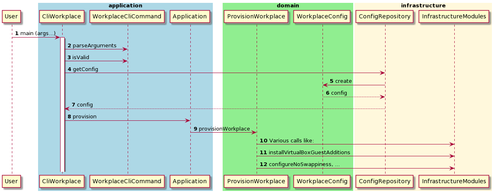

# Provs framework
Provs is a framework for automating tasks for provisioning reasons and other purposes.

It combines
* being able to use the power of shell commands
* a clear and detailed result summary of the built-in execution handling (incl. failure handling and reporting)
* the convenience and robustness of a modern programming language


### Write once, run everywhere

Tasks can be run

* locally
* remotely
* in a local docker container
* in a remote container

Additionally, it is possible to define a custom processor if needed.


## Usage

### Prerequisites

* A **Java Virtual machine** (JVM) is required.
* Download the latest `provs.jar` from: https://gitlab.com/domaindrivenarchitecture/provs/-/releases
* For server functionality (such as install k3s) download the latest `provs-server.jar` from: https://gitlab.com/domaindrivenarchitecture/provs/-/releases


### Show usage options


`java -jar provs.jar -h`

### Provision a desktop workplace locally

Ensure a config file is in place (default config file name is "WorkplaceConfig.yaml") with at least the workplace type specified, e.g.
```type: MINIMAL```

Possible types are currently: MINIMAL, OFFICE or IDE.

Run:

`java -jar provs.jar -l`

### Provision a desktop workplace remotely

`java -jar provs.jar -i -r <ip> -u <remote_username>`

You'll be prompted for the password of the remote user.

### Install k3s

```bash
java -jar provs-server.jar -i -r <ip or hostname> -u <remote_username>
# Example:
java -jar provs-server.jar -i -r 192.168.56.141 -u testuser
```

You'll be prompted for the password of the remote user.


## For developers

### Build the jar-file yourself

* Clone this repo
* Build the fatjar file by `./gradlew fatJarLatest`
* In folder build/libs you'll find the file `provs.jar`

The fatjar is a Java jar-file incl. all required dependencies.

### Sequence diagram

Find below an example of a sequence diagram when provisioning a workplace:

