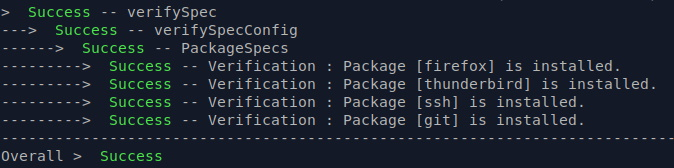

# provs
[](https://gitlab.com/domaindrivenarchitecture/provs/-/commits/master)

[ chat over e-mail](mailto:buero@meissa-gmbh.de?subject=community-chat) | [ meissa@social.meissa-gmbh.de](https://social.meissa-gmbh.de/@meissa) | [Blog](https://domaindrivenarchitecture.org) | [Website](https://meissa.de)

## Purpose

provs provides cli-based tools for 
* **provisioning desktop software** for different desktop types:
  * basic
  * office
  * IDE
* **provisioning a k3s** server
* performing **system checks**
* **execute shell commands** with error handling and result reporting

Can be run locally, remotely or in a container.


## Try out
### Prerequisites

* A **Java Virtual machine** (JVM) is required.
* Install `jarwrapper` (e.g. `sudo apt install jarwrapper`)
* Then either download the binaries or build them yourself

#### Download the binaries

* Download the latest `provs-desktop.jar`,`provs-server.jar` and/or `provs-syspec.jar` from: https://gitlab.com/domaindrivenarchitecture/provs/-/releases
  * Preferably into `/usr/local/bin` or any other folder where executables can be found by the system 
* Make the jar-file executable e.g. by `chmod +x provs-desktop.jar`
* Check with `provs-desktop.jar -h` to show help information

###### Build the binaries

Instead of downloading the binaries you can build them yourself

* Clone this repository
* In the repository's root folder execute: `./gradlew install`. This will install the binaries in `/usr/local/bin`

### Provision a desktop

After having installed `provs-desktop.jar` (see prerequisites) execute:

`provs-desktop.jar <type> <target> [<options>]`

**type** can be: 
* basic - install some basic packages)
* office - install office software (LibreOffice), E-Mail (Thunderbird), etc 
* ide - same as office with additionally ide-software (VSCode, IntelliJ, etc) 

**target** can be: 
* `local`
* remote, e.g. `user123:mypassword@myhost.com` - general format is: <user[:password]@host> - 
  * be sure to have openssh-server installed 
  * add your preferred public key to known_hosts on the target machine
  * if password is omitted, then ssh-keys will be used for authentication
  * if password is omitted but option `-p` is provided, then the password will be prompted interactively 

**options** 
* `-p` for interactive password question
* `-o` for only executing one action, e.g.
  * `-o verify` for verifying your installation
  * `-o firefox` to install firefox from apt on ubuntu


#### Example

```bash
provs-desktop.jar basic local # installs a basic desktop on a local machine
provs-desktop.jar office myuser@myhost.com -p # installs an office desktop on a remote machine, prompting for password
provs-desktop.jar ide myuser@myhost.com # installs an ide on a local machine
provs-desktop.jar ide myuser@myhost.com -o firefox # installs firefox on a remote machine
provs-desktop.jar ide myuser@myhost.com -o verify # verifies the installation on a remote machine
```

### Provision a k3s Server

```bash
provs-server.jar k3s local   # installs a k3s server locally
provs-server.jar k3s myuser@myhost.com   # install remote k3s using ssh-authentication // option -p for password authentication
provs-server.jar k3s myuser@myhost.com -c path/to/k3sServerConfig.yaml -a path/to/application.yaml   # spefifying config and application yaml
provs-server.jar k3s myuser@myhost.com -a app1.yaml,app2.yaml   # apply multiple (comma-separated) application yamls
```

For the remote server please configure a config file (default file name: server-config.yaml).
If filename and path is notgi explicitly specified, then it has to be in the same folder where you execute the provs-server.jar command.
```yaml
fqdn: "myhostname.com"
node:
  ipv4: "192.168.56.123"   # ip address
echo: true                 # for demo reasons only - deploys an echo app 
```

#### Monthly reboot

A monthly reboot can be deployed as only-module (i.e. without a full server deployment) by:

```bash
provs-server k3s <user>@<server> -o monthly_reboot
# Example
provs-server k3s root@myserver.org -o monthly_reboot
```
#### Hetzner CSI driver

To add the hetzner csi driver and encrypted volumes to your k3s installation add the following to the config:

```yaml
hetzner:
  hcloudApiToken:
    source: "PLAIN"           # PLAIN, GOPASS or PROMPT
    parameter: "mypassword"   # the api key for the hetzner cloud
  encryptionPassphrase:
    source: "PLAIN"           # PLAIN, GOPASS or PROMPT
    parameter: "mypassword"   # the encryption passphrase for created volumes
```

or as only-module (i.e. without a full server deployment) by:

```bash
provs-server k3s <user>@<server> -o hetzner_csi
# Example
provs-server k3s root@myserver.org -o hetzner_csi
```

#### Grafana agent

To add a grafana agent to your k3s installation add the following to the config:
  
```yaml
grafana:
  user: "myusername"   # username for the grafana data source 
  url: "https://your-grafana-endpoint-url"
  password:
    source: "PLAIN"           # PLAIN, GOPASS or PROMPT
    parameter: "mypassword"   # the password or api key for the grafana data source user 
  cluster: "mycluster"        # a cluster name of your choice  
```

To provision the grafana agent only to an existing k8s system, ensure that the config (as above) is available and execute:

```bash
provs-server.jar k3s myuser@myhost.com -o grafana
```

To provision the grafana agent only to an existing k8s system, ensure that the config (as above) is available and execute:

```bash
provs-server.jar k3s myuser@myhost.com -o grafana
```

Reprovisioning the server can easily be done using the -r or --reprovision option.

```bash
provs-server.jar k3s myuser@myhost.com -c path/to/k3sServerConfig.yaml -a path/to/application.yaml -r # 
```

Or you can add `reprovision: true` to your k3sServerConfig.yaml. 

### Perform a system check

The default config-file for the system check is `syspec-config.yaml`, you can specify a different file with option `-c <config-file>`.

```bash
provs-syspec.jar local 
# or remote with a custom config filename
provs-syspec.jar myuser@myhost.com -c my-syspec-config.yaml
```

Example output:



## Get help

To get help you can make use of the `-h` option:

```bash
provs-desktop.jar -h
provs-server.jar -h
provs-syspec.jar -h
```

Or to get help for subcommands e.g.

```bash
provs-desktop.jar ide -h
provs-server.jar k3s -h
```

## Development & mirrors

Development happens at: https://repo.prod.meissa.de/meissa/provs

Mirrors are:
* https://codeberg.org/meissa/provs.git
* https://gitlab.com/domaindrivenarchitecture/provs (CI issues and PR)
* https://github.com/DomainDrivenArchitecture/provs

For more details about our repository model see: https://repo.prod.meissa.de/meissa/federate-your-repos

## Developer information

For using provs framework, add the required dependency to your project:
```groovy
dependencies {
    implementation("org.domaindrivenarchitecture:provs:0.46.2") // use latest version
}
```

Then implement your own tasks e.g. by:

```kotlin
fun Prov.myTask() = task {
    cmd("echo \"Hello world!\"")
}
```

See also [ForDevelopers.md](doc/ForDevelopers.md)

### KotlinScript

For an example of a KotlinScript see: [DemoScript.kts](src/main/scripts/DemoScript.kts)