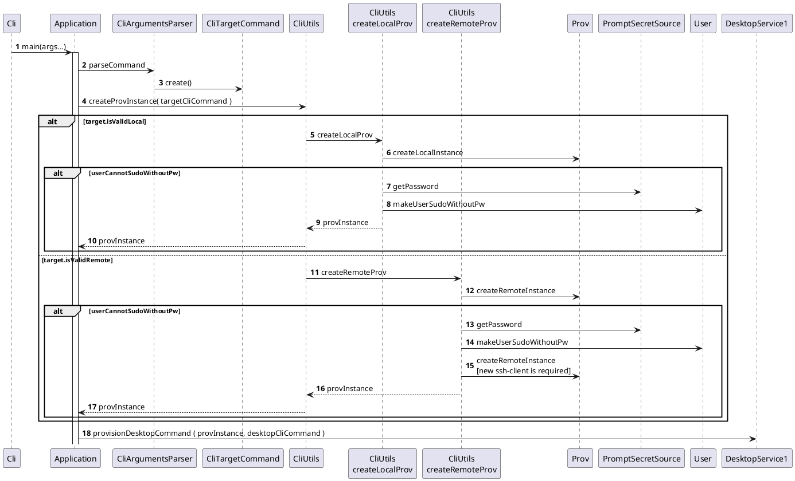

```plantuml
@startuml

autonumber

skinparam sequenceBox {
     borderColor White
}

participant Cli
participant Application
participant CliArgumentsParser
participant CliTargetCommand
participant CliUtils
participant "CliUtils\ncreateLocalProv" as CliUtilsL
participant "CliUtils\ncreateRemoteProv" as CliUtilsR
participant Prov
participant PromptSecretSource
participant User

Cli -> Application ++ : main(args...)
Application -> CliArgumentsParser : parseCommand

CliArgumentsParser -> CliTargetCommand : create()
Application -> CliUtils : createProvInstance( targetCliCommand )
alt target.isValidLocal
CliUtils -> CliUtilsL : createLocalProv
CliUtilsL -> Prov : createLocalInstance
alt userCannotSudoWithoutPw
CliUtilsL -> PromptSecretSource : getPassword
CliUtilsL -> User : makeUserSudoWithoutPw
CliUtilsL --> CliUtils : provInstance
CliUtils --> Application : provInstance
end
else target.isValidRemote
CliUtils -> CliUtilsR : createRemoteProv
CliUtilsR -> Prov : createRemoteInstance
alt userCannotSudoWithoutPw
CliUtilsR -> PromptSecretSource : getPassword
CliUtilsR -> User : makeUserSudoWithoutPw
CliUtilsR -> Prov : createRemoteInstance\n[new ssh-client is required]
CliUtilsR --> CliUtils : provInstance
CliUtils --> Application : provInstance
end
end

Application -> DesktopService1 : provisionDesktopCommand ( provInstance, desktopCliCommand )


'DesktopService1 -> DesktopService2 : provisionDesktop( config )
'DesktopService1 -> ConfigRepository : getConfig

@enduml

```