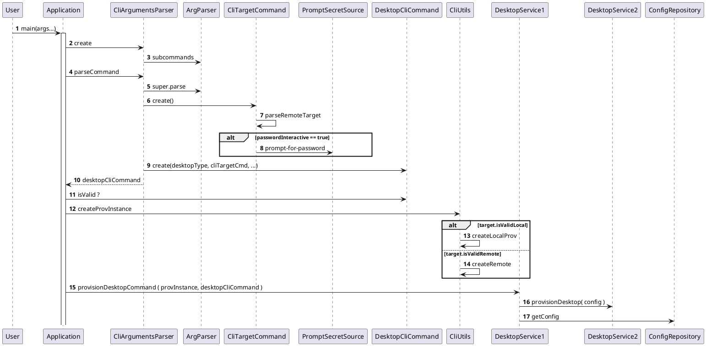

```plantuml
@startuml

autonumber

skinparam sequenceBox {
     borderColor White
}

participant User

User -> Application ++ : main(args...)
Application -> CliArgumentsParser : create
CliArgumentsParser -> ArgParser : subcommands
Application -> CliArgumentsParser : parseCommand
CliArgumentsParser -> ArgParser : super.parse

CliArgumentsParser -> CliTargetCommand : create()
CliTargetCommand -> CliTargetCommand : parseRemoteTarget
alt passwordInteractive == true
CliTargetCommand -> PromptSecretSource :  prompt-for-password
end 
CliArgumentsParser -> DesktopCliCommand : create(desktopType, cliTargetCmd, ...)
CliArgumentsParser --> Application: desktopCliCommand
Application -> DesktopCliCommand : isValid ?
Application -> CliUtils : createProvInstance
alt target.isValidLocal
CliUtils -> CliUtils : createLocalProv
else target.isValidRemote
CliUtils -> CliUtils : createRemote
end
Application -> DesktopService1 : provisionDesktopCommand ( provInstance, desktopCliCommand )
DesktopService1 -> DesktopService2 : provisionDesktop( config )
DesktopService1 -> ConfigRepository : getConfig

@enduml

```