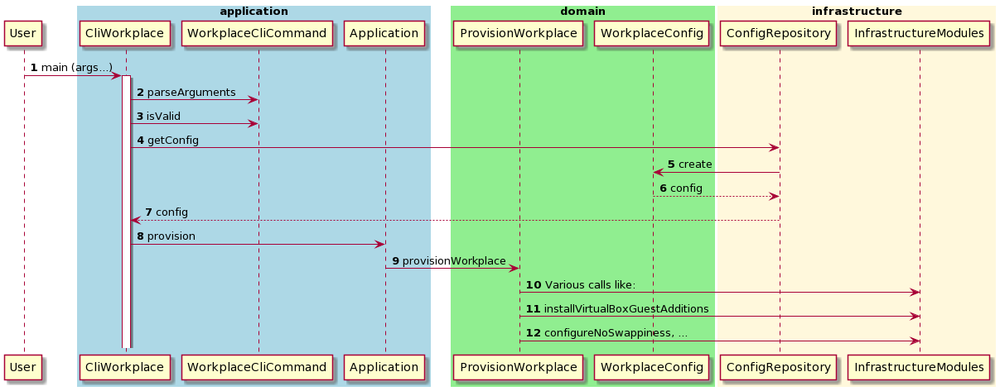

# Information for developers

## Build a provs jar-file yourself

* Clone this repo
* Build the jar-file by `./gradlew uberjarDesktop`
* In folder build/libs you'll find the file `provs.jar`

The fatjar is a Java jar-file incl. all required dependencies.

### Sequence diagram

Find below an example of a sequence diagram when provisioning a desktop workplace:

