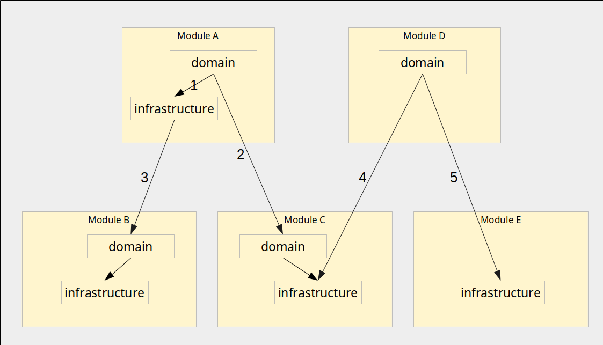

# Modules 

## Modules and their possible relations

#### Modules

A,B,C: Modules with both domain and infrastructure layer code - common type of modules   
D: Module with only domain: can sometimes make sense if only domain logic and no infrastructure logic is required   
E: Module with only infrastructure: usually utility modules that just provide a collection of infrastructure functionality

#### Interactions

1. Domain calls (a function in) the infrastructure of the same module - common practice within a module
1. Domain calls (a function in) the domain another module - common practice between modules
1. Infrastructure calls infrastructure of another module - usually not recommended
1. Domain calls infrastructure in another module - can make sense in some cases e.g. if module D just needs some low-level function of module D. However where possible calling domain of module C should be preferred
1. Domain calls infrastructure in another module, which only has infrastructure - common practice for calling utility modules, which don't have a domain.