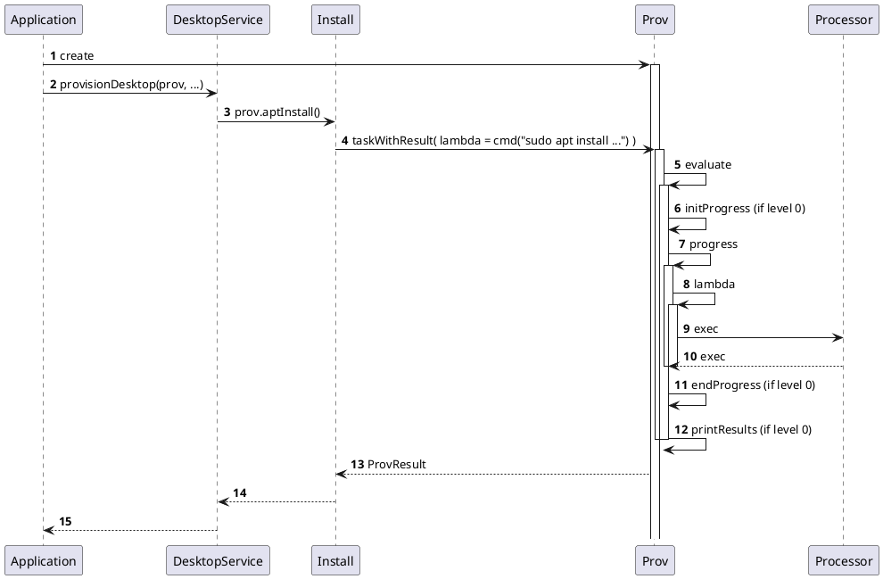

```plantuml
@startuml
autonumber

participant Application
participant DesktopService
participant Install
participant Prov
participant Processor

Application -> Prov: create

activate Prov
Application -> DesktopService: provisionDesktop(prov, ...)
DesktopService -> Install: prov.aptInstall()
Install -> Prov: taskWithResult( lambda = cmd("sudo apt install ...") ) 

activate Prov
Prov -> Prov: evaluate

activate Prov
Prov -> Prov: initProgress (if level 0)
Prov -> Prov: progress

activate Prov
Prov -> Prov: lambda

activate Prov

Prov -> Processor: exec
Prov <-- Processor: exec

deactivate Prov
deactivate Prov

Prov -> Prov: endProgress (if level 0)
Prov -> Prov: printResults (if level 0)

deactivate Prov
deactivate Prov

Install <-- Prov: ProvResult
DesktopService <-- Install
Application <-- DesktopService

@enduml
```