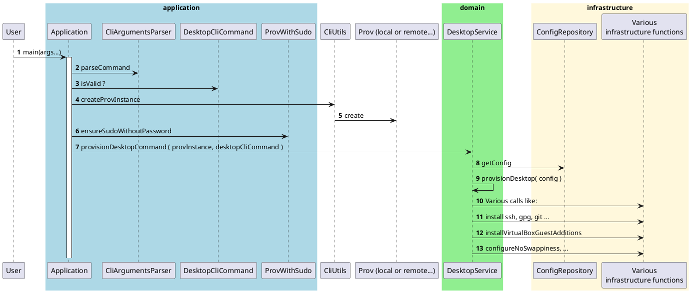

```plantuml
@startuml

autonumber

skinparam sequenceBox {
     borderColor White
}

participant User

box "application" #LightBlue
participant Application
participant CliArgumentsParser
participant DesktopCliCommand
participant ProvWithSudo
end box

box  #White
participant CliUtils
participant "Prov (local or remote...)" as ProvInstance
end box

box "domain" #LightGreen
participant "DesktopService"
end box

box "infrastructure" #CornSilk
participant ConfigRepository
participant "Various\ninfrastructure functions" as Infrastructure_functions
end box


User -> Application ++ : main(args...)
Application -> CliArgumentsParser : parseCommand
Application -> DesktopCliCommand : isValid ?
Application -> CliUtils : createProvInstance
ProvInstance <- CliUtils : create

Application -> ProvWithSudo : ensureSudoWithoutPassword
Application -> DesktopService : provisionDesktopCommand ( provInstance, desktopCliCommand )

DesktopService -> ConfigRepository : getConfig

DesktopService -> DesktopService : provisionDesktop( config )

DesktopService -> Infrastructure_functions: Various calls like:
DesktopService -> Infrastructure_functions: install ssh, gpg, git ...
DesktopService -> Infrastructure_functions: installVirtualBoxGuestAdditions
DesktopService -> Infrastructure_functions: configureNoSwappiness, ...

@enduml
```