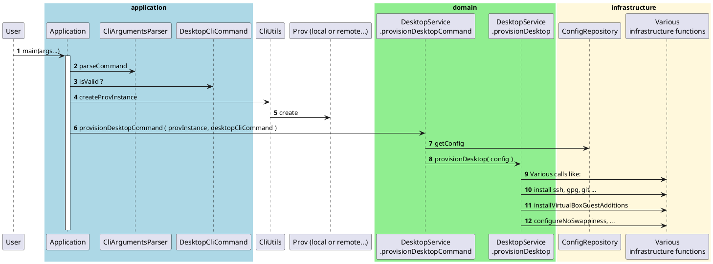

```plantuml
@startuml

autonumber

skinparam sequenceBox {
     borderColor White
}

participant User

box "application" #LightBlue
participant Application
participant CliArgumentsParser
participant DesktopCliCommand
end box

box  #White
participant CliUtils
participant "Prov (local or remote...)" as ProvInstance
end box

box "domain" #LightGreen
participant "DesktopService\n.provisionDesktopCommand" as DesktopService1
participant "DesktopService\n.provisionDesktop" as DesktopService2
end box

box "infrastructure" #CornSilk
participant ConfigRepository
participant "Various\ninfrastructure functions" as Infrastructure_functions
end box


User -> Application ++ : main(args...)
Application -> CliArgumentsParser : parseCommand
Application -> DesktopCliCommand : isValid ?
Application -> CliUtils : createProvInstance
ProvInstance <- CliUtils : create
Application -> DesktopService1 : provisionDesktopCommand ( provInstance, desktopCliCommand )
DesktopService1 -> ConfigRepository : getConfig
DesktopService1 -> DesktopService2 : provisionDesktop( config )

DesktopService2 -> Infrastructure_functions: Various calls like:
DesktopService2 -> Infrastructure_functions: install ssh, gpg, git ...
DesktopService2 -> Infrastructure_functions: installVirtualBoxGuestAdditions
DesktopService2 -> Infrastructure_functions: configureNoSwappiness, ...

@enduml
```