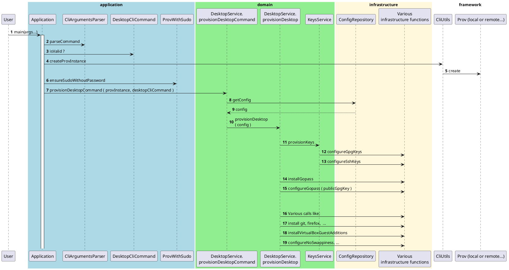

```plantuml
@startuml

autonumber

skinparam sequenceBox {
     borderColor White
}

participant User

box "application" #LightBlue
participant Application
participant CliArgumentsParser
participant DesktopCliCommand
participant ProvWithSudo
end box

box "domain" #LightGreen
participant "DesktopService.\nprovisionDesktopCommand" as provisionDesktopCommand
participant "DesktopService.\nprovisionDesktop" as provisionDesktop
participant "KeysService"
end box

box "infrastructure" #CornSilk
participant ConfigRepository
participant "Various\ninfrastructure functions" as Infrastructure_functions
end box

box "framework" #White
participant CliUtils
participant "Prov (local or remote...)" as ProvInstance
end box


User -> Application ++ : main(args...)
Application -> CliArgumentsParser : parseCommand
Application -> DesktopCliCommand : isValid ?
Application -> CliUtils : createProvInstance
ProvInstance <- CliUtils : create

Application -> ProvWithSudo : ensureSudoWithoutPassword
Application -> provisionDesktopCommand : provisionDesktopCommand ( provInstance, desktopCliCommand )

provisionDesktopCommand -> ConfigRepository : getConfig
provisionDesktopCommand <-- ConfigRepository : config

provisionDesktopCommand -> provisionDesktop : provisionDesktop\n( config )

|||

provisionDesktop -> "KeysService" : provisionKeys
"KeysService" -> Infrastructure_functions : configureGpgKeys
"KeysService" -> Infrastructure_functions : configureSshKeys

|||

"provisionDesktop" -> Infrastructure_functions : installGopass
"provisionDesktop" -> Infrastructure_functions : configureGopass ( publicGpgKey )

|||
|||

provisionDesktop -> Infrastructure_functions: Various calls like:
provisionDesktop -> Infrastructure_functions: install git, firefox,  ...
provisionDesktop -> Infrastructure_functions: installVirtualBoxGuestAdditions
provisionDesktop -> Infrastructure_functions: configureNoSwappiness, ...

@enduml
```
