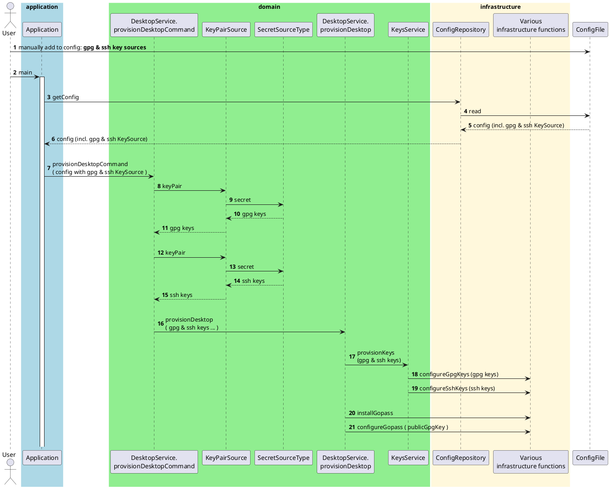

```plantuml
@startuml

autonumber

skinparam sequenceBox {
     borderColor White
}

actor User


box "application" #LightBlue
participant Application
end box

box "domain" #LightGreen
participant "DesktopService.\nprovisionDesktopCommand" as provisionDesktopCommand

participant KeyPairSource
participant SecretSourceType
participant "DesktopService.\nprovisionDesktop" as provisionDesktop
participant "KeysService"
end box

box "infrastructure" #CornSilk
participant ConfigRepository
participant "Various\ninfrastructure functions" as Infrastructure_functions
end box

box "framework" #LightGrey

end box

participant ConfigFile

User -> ConfigFile : manually add to config: **gpg & ssh key sources**

|||

User -> Application ++ : main

|||

Application -> ConfigRepository : getConfig
ConfigFile <- ConfigRepository : read
ConfigFile --> ConfigRepository : config (incl. gpg & ssh KeySource)
Application <-- ConfigRepository : config (incl. gpg & ssh KeySource)

|||

Application -> provisionDesktopCommand : provisionDesktopCommand\n( config with gpg & ssh KeySource )
provisionDesktopCommand -> KeyPairSource : keyPair
KeyPairSource -> SecretSourceType : secret
KeyPairSource <-- SecretSourceType : gpg keys
provisionDesktopCommand <-- KeyPairSource : gpg keys

|||

provisionDesktopCommand -> KeyPairSource : keyPair
KeyPairSource -> SecretSourceType : secret
KeyPairSource <-- SecretSourceType : ssh keys
provisionDesktopCommand <-- KeyPairSource : ssh keys

|||

provisionDesktopCommand -> provisionDesktop : provisionDesktop\n( gpg & ssh keys ... )

|||

provisionDesktop -> "KeysService" : provisionKeys\n(gpg & ssh keys)
"KeysService" -> Infrastructure_functions : configureGpgKeys (gpg keys)
"KeysService" -> Infrastructure_functions : configureSshKeys (ssh keys)

|||

"provisionDesktop" -> Infrastructure_functions : installGopass
"provisionDesktop" -> Infrastructure_functions : configureGopass ( publicGpgKey )

|||

@enduml
```
