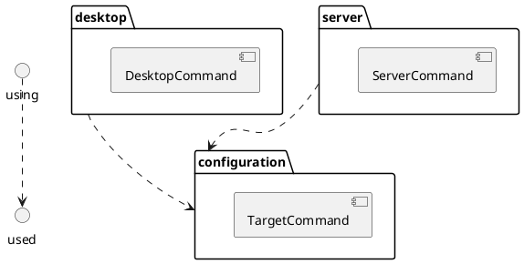
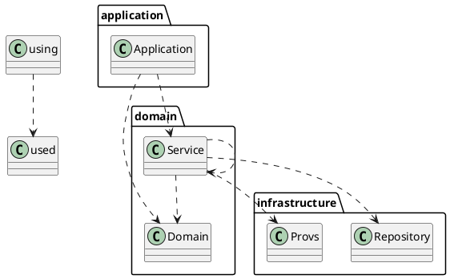

# Bounded Contexts

```plantuml
@startuml
package "configuration" {
  [TargetCommand]
}

package "desktop" {
    [DesktopCommand]
}

package "server" {
    [ServerCommand]
}

server ..> configuration
desktop ..> configuration

using ..> used
@enduml
```

# DDD in Provs

```plantuml
@startuml
'https://plantuml.com/class-diagram

package application {
    class Application
}

package domain {
    class Service
    class Domain
}
Application ..> Service
Application ..> Domain

package infrastructure {
    class Repository
    class Provs
}
Service ..> Domain
Service ..> Service
Service ..> Repository
Service ..> Provs

using ..> used
@enduml
```