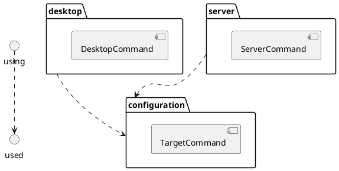

```plantuml
@startuml
package "configuration" {
  [TargetCommand]
}

package "desktop" {
    [DesktopCommand]
}

package "server" {
    [ServerCommand]
}

server ..> configuration
desktop ..> configuration

using ..> used
@enduml
```