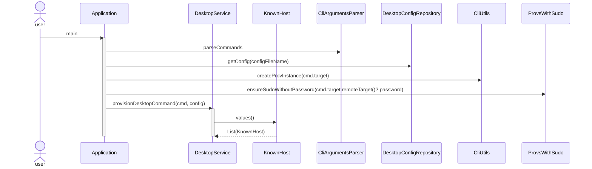
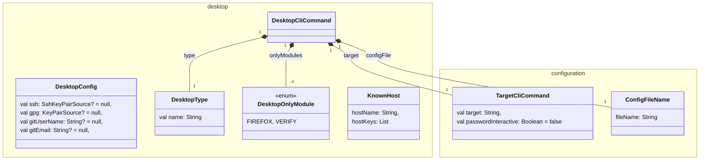

## Initialization

```mermaid
sequenceDiagram
    actor user
    participant app as Application
    participant ds as DesktopService
    participant gtr as KnownHost
    participant pa as CliArgumentsParser
    participant cr as DesktopConfigRepository
    participant ut as CliUtils
    participant su as ProvsWithSudo

    user ->> app: main
    activate app
    app ->> pa: parseCommands
    app ->> cr: getConfig(configFileName)
    app ->> ut: createProvInstance(cmd.target)
    app ->> su: ensureSudoWithoutPassword(cmd.target.remoteTarget()?.password)
    app ->> ds: provisionDesktopCommand(cmd, config)
    activate ds
    ds ->> gtr: values()
    gtr -->> ds: List(KnownHost)
    deactivate ds
    deactivate app
```

## Domain

```mermaid
classDiagram
    
    namespace configuration {
        
        class TargetCliCommand {
            val target: String,
            val passwordInteractive: Boolean = false
        }
        
        class ConfigFileName {
            fileName: String
         }
    }

    namespace desktop {
        
        class DesktopCliCommand {
        }

        class DesktopConfig {
            val ssh: SshKeyPairSource? = null,
            val gpg: KeyPairSource? = null,
            val gitUserName: String? = null,
            val gitEmail: String? = null,
        }

        class DesktopType {
            val name: String
        }
        class DesktopOnlyModule {
            <<enum>>
            FIREFOX, VERIFY
        }
        
        class KnownHost {
            hostName: String, 
            hostKeys: List<HostKey>
        }
    }

    DesktopCliCommand "1" *-- "1" DesktopType: type
    DesktopCliCommand "1" *-- "1" TargetCliCommand: target
    DesktopCliCommand "1" *-- "1" ConfigFileName: configFile
    DesktopCliCommand "1" *-- "..n" DesktopOnlyModule: onlyModules

```