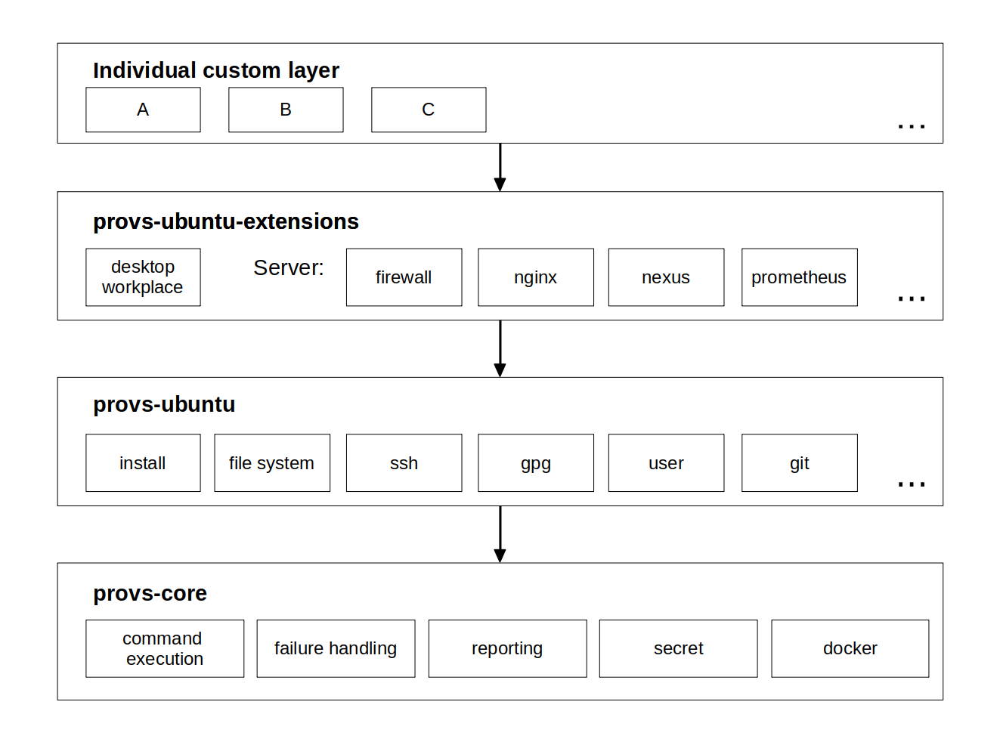
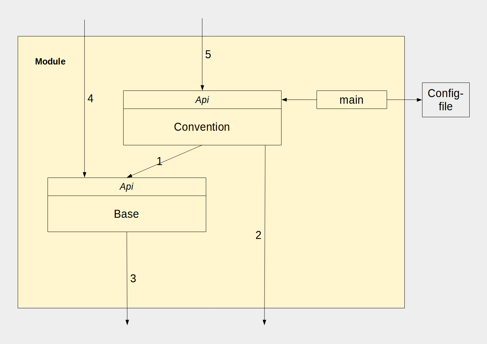
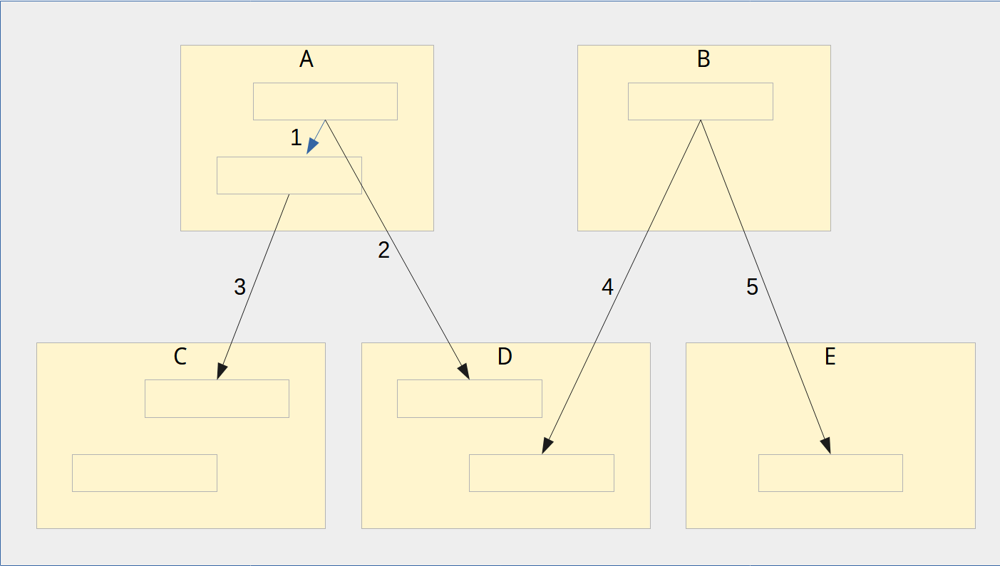

This repository holds the documentation of the provs framework.

# Provs framework

Provs is an easy-to-use provisioning framework for automating shell-commands or other tasks for provisioning reasons and other purposes.

It combines 
* convenience and robustness of a modern programming language
* the power of shell commands 
* clear and detailed result summary of the built-in execution handling 

The provs framework consists of several layers. The most important are
* provs-core
* provs-ubuntu
* provs-ubuntu-extensions

### Write once, run everywhere

Tasks can be run

* locally
* remotely
* in a local docker container
* and also in a remote container
  
Besides, it is possible to define a custom processor.

## Usage

For usage examples it is recommended to have a look at [provs-scripts](https://gitlab.com/domaindrivenarchitecture/provs-scripts) or [provs-ubuntu-extensions](https://gitlab.com/domaindrivenarchitecture/provs-ubuntu-extensions).

## "Implarative" 

Configuration management tools are usually classified as either **imperative** or **declarative**. 
Imperative means that you define the steps which are necessary to achieve the goal. 
Declarative means that you just define the state which you want to achieve, and the tooling figures out itself how this goal is achieved. 

The provs framework is aimed to offer the best of both worlds. 
Based on the imperative paradigm it offers advantages as: full control of execution order, clear control flow, 
all kinds of looping and conditional constructs, easy debugging. 
Furthermore, you are not limited by a DSL, you can make use of the full power of shell commands.  

On the other hand, the built-in functions of the provs framework also provide important advantages of the declarative paradigm, as for example idempotence resp. quasi-idempotence. 

## Idempotence vs quasi-idempotence

Idempotence means that you can run the same function once or several times without problems, you'll always get the same result.  
However, there are cases where you don't want strict idempotence. E.g. if you are installing a program or cloning a git repo a second time, you might want to get just the latest version,
even if an older version has already been installed earlier. This behavior is also known as quasi-idempotence. 
The provs framework uses quasi-idempotence where "real" idempotence is not possible or does not make sense. 
For example, if you invoke "gitClone" a second time for the same repo, it will perform a "git pull" in order to retrieve the latest version of the repo. 
Note, that git itself would throw an error if you would attempt to clone a repository twice.

## Architecture

Multiple layers provide different levels of functionality:

## Module structure

Explanation:
* **Convention**: contains at least one function that provides the main functionality of this module.
* **Base**: contains functions that provide more low-level functionalities of this module.

About the dependencies have a look at the explanations in the chapter below.

## Module dependencies

__Explanation__:

Modules:

<ol type="A">
  <li>Common module: has both a convention layer and a base layer</li>
  <li>Module with only convention layer: e.g. for very simple logic where no base layer is needed</li>
  <li>Module with only base layer: these are often _utility modules_, which provide a collection of utility functions</li>
</ol>

Dependencies:

1. Convention layer calls (a function in) the base layer of the same module
    * _Common practice of dependencies within a module_
1. Convention layer calls (a function in) the convention layer another module
    * _Common practice of dependencies between modules_
1. Base layer calls convention layer
    * _Usually not recommended!_
4. Convention layer calls base layer in another module
    * _This sometimes can make sense, e.g. if module B just needs some low-level function of module D instead of full provisioning. 
      However, in most cases it is recommended to call the convention layer of module D whenever possible_
5. Convention layer calls base layer in another module, which only has base layer
    * _Common practice for calling utility modules, which don't have a convention layer._

